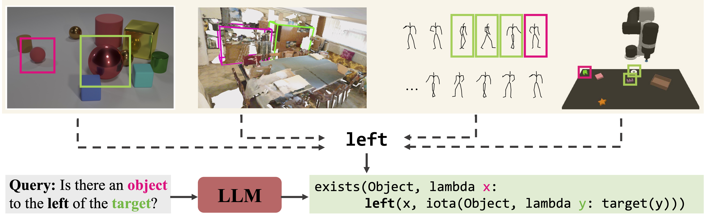

# Logic-Enhanced Foundation Model



<br />
<br />
**What’s *Left*? Concept Grounding with Logic-Enhanced Foundation Models**
<br />
[Joy Hsu](http://web.stanford.edu/~joycj/)\*,
[Jiayuan Mao](http://jiayuanm.com/)\*,
[Joshua B. Tenenbaum](http://web.mit.edu/cocosci/josh.html),
[Jiajun Wu](https://jiajunwu.com/)
<br />
In Conference on Neural Information Processing Systems (NeurIPS) 2023
<br />

## Setup
Run the following commands to setup LEFT.

Make a new conda environment.
```bash
  conda create -n left python=3.10
```

Install [Jacinle](https://github.com/vacancy/Jacinle).
```bash
  git clone https://github.com/vacancy/Jacinle --recursive
  export PATH=<path_to_jacinle>/bin:$PATH
```

Install [Concepts](https://github.com/concepts-ai/concepts).
```bash
  git clone https://github.com/concepts-ai/Concepts.git
  cd Concepts
  pip install -e .
```

Install the below libraries to train models.
```bash
  conda install tensorflow
  pip install charset
```

Install the below libraries to run the demo.
```bash
  pip install notebook
  pip install opencv-python
```

You may need to add the below import in the demo notebook.
```bash
  import sys
  sys.path.append("<path_to_Jacinle>")
```

Note: you may need to install a PyTorch version that has been compiled with your version of the CUDA driver. For example, `conda install pytorch==1.11.0 torchvision==0.12.0 torchaudio==0.11.0 cudatoolkit=11.3 -c pytorch`

## Demo
Please check out this [demo notebook](starter-simple-shapes.ipynb), to see how to apply LEFT on a new dataset in ~100 lines of code! 

## Train & evaluation
Please see the individual READMEs. 

## Warning
LEFT leverages a pre-trained large language model as its language interpreter, and hence, even though our prompts are general examples of first-order logic, we do not have direct control over the LLM's generation. The LLM may output harmful biases.

